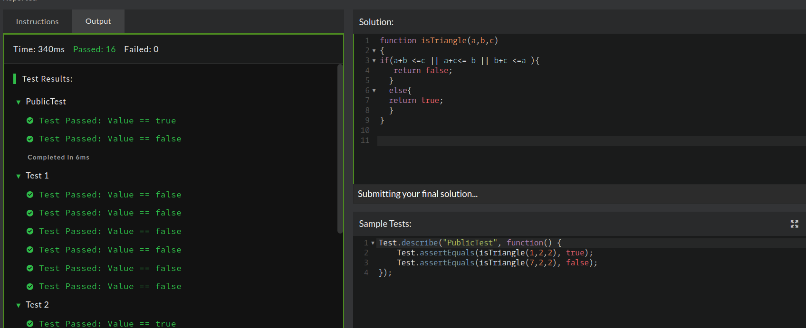

## CodeWars Challenge- 9

Description:
Implement a method that accepts 3 integer values a, b, c. The method should return true if a triangle can be built with the sides of given length and false in any other case.

(In this case, all triangles must have surface greater than 0 to be accepted).

*Test Case:*

1. Test.describe("PublicTest", function() {
    Test.assertEquals(isTriangle(1,2,2), true);
    Test.assertEquals(isTriangle(7,2,2), false);
});

## Solved Using:

1. JavaScript

## My Solution:

There are technically two types of triangles, an isosceles triangle has at least two sides of equal length(which is why an equilateral triangle, which has three sides of the same length, would fall under this category) & a scalene triangle, in which all sides are different lengths.

The Triangle Inequality Theorem states that the sum of any 2 sides of a triangle must be greater than the measure of the third side, using these guideline I created my if statement to test for a triangle. 
